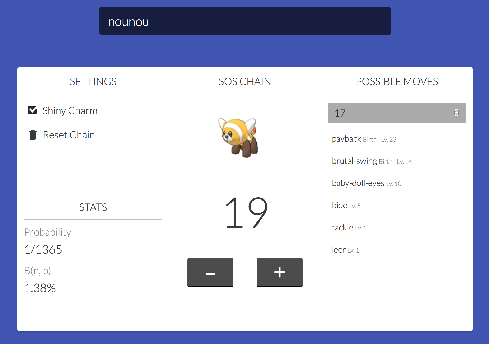

# SOS Chain Counter

> A tool for helping shiny hunters.



## Features

- [x] Search Pokemon in most languages
- [x] SOS Chain counter
- [X] Shows statistics based on your configuration (chain + shiny charm)
- [X] Shows possible moves based on the Pokemon level
- [X] Persists your chain in your brower
- [ ] Usable offline once the Pokemon information has been fetched
- [ ] Streamer mode

## Development

*This project is based on `Create React App`*

```sh
# Install dependencies
npm install

# Run the project
npm start

# Open localhost:3000
```